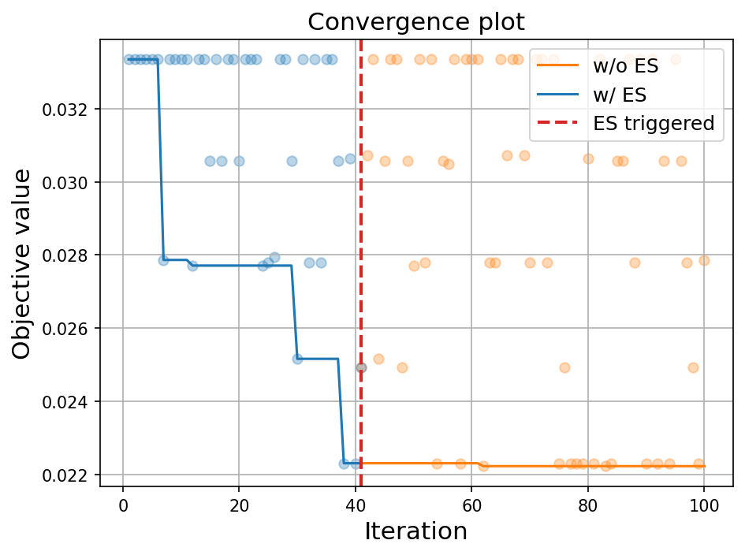
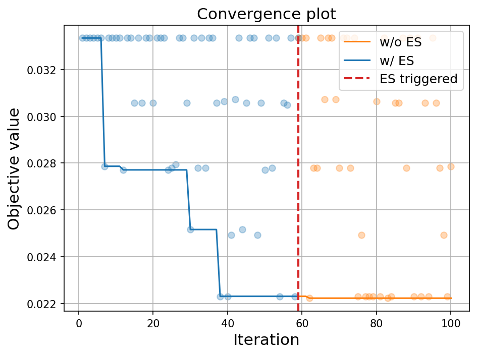

# 早停

在本教程中，我们将介绍如何在OpenBox中使用早停算法（Early Stopping, ES）。早停是一种在模型训练过程中用来防止过拟合的技术。在OpenBox中，早停算法通过监控优化过程的进展，并在满足特定条件时提前结束优化，以节省计算资源并防止过拟合。目前早停算法仅适用于单目标优化。

### 早停策略

OpenBox中的早停算法主要基于两个策略：

1. **无改进轮数（No Improvement Rounds）**:
   - 如果在一定数量的连续优化轮数内没有观察到任何改进，则在该轮采集函数提出候选配置前触发早停。
2. **改进阈值（Improvement Threshold）**:
   - 如果采集函数提出候选配置后，该配置的期望改进（Expected Improvement，EI）小于特定阈值，即当前最佳目标值与默认目标值之间差异的一定百分比，则触发早停，说明当前情况下预期改进不足以被认为应该继续优化。注意，使用该策略时需要采集函数类型为EI。

### 参数解释

在创建`Optimizer`类时，通过设置`early_stop=True`启用早停策略，默认情况下不启用早停。启用后，向`early_stop_kwargs`传入含参数的字典用于配置早停逻辑，具体参数如下：

- `min_iter` (int): 考虑早停之前的最小迭代次数。这确保了算法在考虑停止之前有足够的时间来探索配置空间。默认为10，范围应大于零。
- `max_no_improvement_rounds` (int): 允许的最大无改进轮数，用于无改进轮数策略。如果连续这么多轮次没有改进，则触发早停。默认启动该策略，默认值为10。如设置为0，则代表不启用该策略。
- `min_improvement_percentage` (float): 最小改进百分比，用于改进阈值策略。如果预期改进小于`min_improvement_percentage`乘以当前最佳目标值与默认目标值的差，则触发早停。开启早停后默认启用该策略，默认值为0.05。如设置为0，则代表不启用该策略。

### LightGBM调优示例

假设我们要使用OpenBox来调优LightGBM模型的参数。我们遵循{ref}`LightGBM超参数优化教程 <articles/openbox_LightGBM:LightGBM超参数优化教程>`。定义超参数空间、目标函数配置空间，以下是启动早停的执行优化部分示例代码：

```python
from openbox import Optimizer
opt = Optimizer(
    objective_function,
    config_space,
    max_runs=100,
    surrogate_type='prf',
    task_id='tuning_lightgbm',
    early_stop=True,
    early_stop_kwargs=dict(
        min_iter=10,
        max_no_improvement_rounds=30,
        min_improvement_percentage=0.05,
    ),
    random_state=1,
)
history = opt.run()
```

早停输出如下：

```
[Early Stop] EI less than the threshold! min_improvement_percentage=0.05, default_obj=0.03334620334620342, best_obj=0.022310167310167328, threshold=0.0005518018018018045, max_EI=[0.00051861]
Early stop triggered at iter 41!
```

说明在41轮时，由于候选配置的期望改进小于设定期望阈值，发生早停。

我们可以将不启用和启动早停的两个收敛曲线进行对比，发现在该早停配置下有效的提前结束了优化。



不同的早停配置会对停止轮数和效果产生影响，如设置`max_no_improvement_rounds=20`, `min_improvement_percentage=0.02`（其余配置与上述相同），得到的早停输出如下：

```
[Early Stop] No improvement over 21 rounds!
Early stop triggered at iter 59!
```

说明在59轮时，发现目标函数未改进轮数超过阈值，发生早停。

与不启用早停的收敛曲线进行对比，结果如下：

